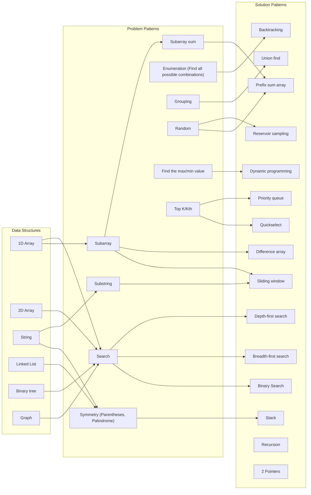

# Coding Interview

- [**Learning Resources**](#learning-resources)
- [**Basics**](#basics)
- [**Complexity**](#complexity)
- [**Data Structures**](#data-structures)
- [**Solution Patterns**](#solution-patterns)
- [**Problem Patterns**](#problem-patterns)
- [**Problems In Real Interviews**](#problems-in-real-interviews)

## Learning Resources
- [**LeetCode**](https://leetcode.com/)
- [**HackerRank**](https://www.hackerrank.com/)
- [**Algo Monster**](https://algo.monster/)
- [**NeetCode**](https://neetcode.io/)
- [**Grokking the Coding Interview: Patterns for Coding Questions**](https://www.designgurus.io/course/grokking-the-coding-interview)
- [**Tech Interview Handbook: Coding interview preparation**](https://www.techinterviewhandbook.org/coding-interview-prep/)
- [**InterviewBit**](https://www.interviewbit.com/)
- [**labuladong 的算法笔记**](https://labuladong.github.io/algo/)

## Basics
- [**Java Coding**](docs/basics/JavaCoding.md)
- [**Math Basics**](docs/basics/Math_Basics.md)
   - [Modulo operation](docs/basics/Math_Basics.md#modulo-operation)
- [**Problems And Solutions Quick Table**](docs/basics/Problems_And_Solutions_Quick_Table.md)

## Complexity
- [**Time Complexity**](docs/complexity/Time_Complexity.md)
- [**Space Complexity**](docs/complexity/Space_Complexity.md)

## Data Structures
- [**String**](docs/data-structure/string/String.md)
- [**Array**](docs/data-structure/array/Array.md)
- [**2D Array**](docs/data-structure/array/2D_Array.md)
- [**Linked List**](docs/data-structure/linked_list/Linked_List.md)
- [**Queue**](docs/data-structure/queue/Queue.md)
- [**Stack**](docs/data-structure/stack/Stack.md)
- [**Binary Tree**](docs/data-structure/tree/Binary_Tree.md)
- [**Graph**](docs/data-structure/graph/Graph.md)
- [**Heap**](docs/data-structure/tree/Heap.md)
- [**Trie**](docs/data-structure/tree/Trie.md)

## Solution Patterns
- [**Breadth-First Search (BFS)**](docs/solution-patterns/Breadth_First_Search.md)
- [**Depth-First Search (DFS)**](docs/solution-patterns/Depth_First_Search.md)
- [**Dynamic Programming**](docs/solution-patterns/Dynamic_Programming.md)
- [**Backtraking**](docs/solution-patterns/Backtracking.md)
- [**Union Find (Disjoint Set)**](docs/solution-patterns/Union_Find.md)
- [**Binary Search**](docs/solution-patterns/Binary_Search.md)
- [**2 Pointers**](docs/solution-patterns/2_Pointers.md)
- [**Sliding Window**](docs/solution-patterns/Sliding_Window.md)
- [**Prefix Sum Array**](docs/solution-patterns/Prefix_Sum_Array.md)
- [**Difference Array**](docs/solution-patterns/Difference_Array.md)
- [**Frequency Counters**](docs/solution-patterns/Frequency_Counter.md)
- [**Reservoir Sampling**](docs/solution-patterns/Reservoir_Sampling.md)
- [**Heap (Priority Queue)**](docs/data-structure/tree/Heap.md)
- [**Trie**](docs/data-structure/tree/Trie.md)
- [**Quickselect (Hoare's selection algorithm)**](docs/solution-patterns/Quickselect.md)
- [**Bit Manipulation**](docs/solution-patterns/Bit_Manipulation.md)
   - Bitmask
- [**Monotonic Stack**](docs/solution-patterns/Monotonic_Stack.md)
- [Divide and Conquer]()
- [Sorting]()
- [Greedy]()
- [Recursion]()
- Other algorithms
   - [Kahn's algorithm](docs/problem_patterns/Topological_Sorting.md#kahns-algorithm)
   - [Sweep line algorithm](docs/solution-patterns/Sweep_Line_Algorithm.md)
   - Kadane's algorithm
   - Dijkstra's algorithm
   - Easy rolling
   - Bidirectional search
   - Counting sort
   - Kruskal's algorithm (for minimum spanning tree)
   - Kadane's Algorithm
   - Fenwick tree or binary indexed tree (BIT)

## Problem Patterns
### New
- [**Problem Categories**](docs/problem_patterns/Problem_Categories.md)
- [**Random**](docs/problem_patterns/Random.md)
- [**Interval**](docs/problem_patterns/Interval.md)
- [**Detect Cycle**](docs/problem_patterns/Detect_Cycle.md)
- [**Top K and Kth**](docs/problem_patterns/Top_K_And_Kth.md)
- [**Topological sorting**](docs/problem_patterns/Topological_Sorting.md)
- Minimum spanning tree
- Knapsack

### Need to remove below
- **Longest X sequence/substring**
   - LeetCode-298 Binary Tree Longest Consecutive Sequence
- **Integer Calculation** (Integers represents in other data structures and then calculation)
   - In String
      - LeetCode-415 Add Strings
      - LeetCode-43 Multiply Strings
      - LeetCode-67 Add Binary
   - In Array
      - LeetCode-66 Plus One
      - LeetCode-989 Add to Array-Form of Integer 

## Problems In Real Interviews
### Meta
| Problem | Company | Stage |
|----|----|----|
| [Get Equilibrium Index from Array](docs/problems/array/Get_Equilibrium_Index_From_Array.md) | Facebook | Screening |
| [Get Sums of All Root-to-leaf Paths](docs/problems/tree/path/Get_Sums_Of_All_Root_To_Leaf_Paths_From_Binary_Tree.md) | Facebook | Onsite |
| [Find Missing Ranges from Array](docs/problems/array/Find_Missing_Ranges_from_Array.md) | Facebook | Onsite |
| [Get Range Sum of Binary Search Tree](docs/problems/tree/Get_Range_Sum_Of_Binary_Search_Tree.md) | Facebook | Onsite |
| [Divide Two Integers](docs/problems/math/Divide_Two_Integers.md) | Facebook | Onsite | 

### Amazon
- 2023
   - [OA](docs/problems/other/amazon#readme)
   - VO
      - [Best Time to Buy and Sell Stock In 1 Transaction](docs/problems/array/stock/Best_Time_To_Buy_And_Sell_Stock_In_1_Transaction.md)
      - [Climbing Stairs](docs/problems/other/Climbing_Stairs.md)
      - [Data Structure with All Operations in O(1)](docs/problems/other/Data_Structure_With_All_O1_Operations.md)
- 2021
   - OA
     | Problem | Company | Stage |
     |----|----|----|
     | [Optimizing Box Weights](docs/problems/array/Optimizing_Box_Weights.md) | Amazon | Screening |
     | [Gifting Group (Get Number of Groups in Undirected Graph)](docs/problems/graph/Get_Number_Of_Groups_In_Undirected_Graph.md) | Amazon | Screening |

### ByteDance
- [ByteDance OA and VO](https://github.com/wuyichen24/coding-interview/blob/master/ByteDance.md)
